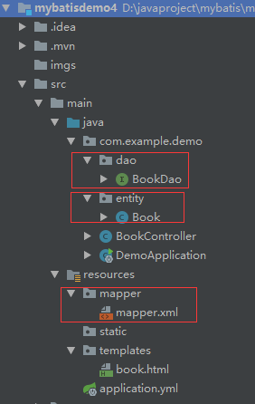

# 原生手写mybatis简介

1. dao层mapper类、entity实体类、mapper.xml都需要自己写



2. 需要配置扫描dao层mapper类的@MapperScan或者@Mapper的注解
``` 
@Mapper
public interface BookDao {
    List<Book> getAll();
}
```
或
``` 
@SpringBootApplication
@MapperScan("com.example.demo.dao")
public class DemoApplication {

    public static void main(String[] args) {
        SpringApplication.run(DemoApplication.class, args);
    }

}
```

3. 需要在application.yml配置扫描mapper.xml的属性

``` 
mybatis:
  # 找到mapper的xml
  mapper-locations: classpath:mapper/*.xml
  # 找到mapper的实体类
  type-aliases-package: com.example.demo.entity

```


# 创建数据库
``` 
use mydb;

DROP TABLE IF EXISTS `book`;
SET character_set_client = utf8mb4 ;
CREATE TABLE `book` (
  `id` int(10) NOT NULL AUTO_INCREMENT,
  `name` varchar(20) DEFAULT NULL,
  `author` varchar(20) DEFAULT NULL,
  `publish` varchar(20) DEFAULT NULL,
  `pages` int(10) DEFAULT NULL,
  `price` float(10,2) DEFAULT NULL,
  `bookcaseid` int(10) DEFAULT NULL,
  `abled` int(10) DEFAULT NULL,
  PRIMARY KEY (`id`)
) ENGINE=InnoDB AUTO_INCREMENT=29 DEFAULT CHARSET=utf8;

INSERT INTO `book` VALUES
(1,'解忧杂货店','东野圭吾','南海出版公司',102,27.30,2,0),
(2,'追风筝的人','卡勒德·胡赛尼','上海人民出版社',230,33.50,3,1),
(3,'人间失格','太宰治','作家出版社',150,17.30,1,1),
(4,'这就是二十四节气','高春香','海豚出版社',220,59.00,3,1),
(5,'白夜行','东野圭吾','南海出版公司',300,27.30,4,1),
(6,'摆渡人','克莱儿·麦克福尔','百花洲文艺出版社',225,22.80,1,1),
(7,'暖暖心绘本','米拦弗特毕','湖南少儿出版社',168,131.60,5,1),
(8,'天才在左疯子在右','高铭','北京联合出版公司',330,27.50,6,1),
(9,'我们仨','杨绛','生活.读书.新知三联书店',89,17.20,7,1),
(10,'活着','余华','作家出版社',100,13.00,1,1),
(11,'水浒传','施耐庵','三联出版社',300,50.00,1,1),
(12,'三国演义','罗贯中','三联出版社',300,50.00,2,1),
(13,'红楼梦','曹雪芹','三联出版社',300,50.00,5,1),
(14,'西游记','吴承恩','三联出版社',300,60.00,3,1);
```

# 创建entity实体类
``` 
public class Book {
    private int id;
    private String name;
    private String author;
    private String publish;
    private int pages;
    private double price;
    
    //...
}    
```

# 创建dao层mapper类

``` 
public interface BookDao {
    List<Book> getAll();
}
```

# 创建mapper.xml
``` 
<?xml version="1.0" encoding="UTF-8" ?>
<!DOCTYPE mapper PUBLIC "-//mybatis.org//DTD Mapper 3.0//EN" "http://mybatis.org/dtd/mybatis-3-mapper.dtd">
<mapper namespace="com.example.demo.dao.BookDao">

    <select id="getAll" resultType="com.example.demo.entity.Book">
		select * from book
	</select>
</mapper>
```

# 配置数据库和mybatis

``` 
spring:
  datasource:
    driver-class-name: com.mysql.cj.jdbc.Driver
    url: jdbc:mysql://127.0.0.1:3306/mydb?useUnicode=true&characterEncoding=utf8&useSSL=false&serverTimezone=GMT
    username: root
    password: admin
  thymeleaf:
    # 找到thymeleaf的文件
    prefix: classpath:/templates/

mybatis:
  # 找到mapper的xml
  mapper-locations: classpath:mapper/*.xml
  # 找到mapper的实体类
  type-aliases-package: com.example.demo.entity

```

# 启动类添加@MapperScan

``` 
@SpringBootApplication
@MapperScan("com.example.demo.dao")
public class DemoApplication {

    public static void main(String[] args) {
        SpringApplication.run(DemoApplication.class, args);
    }

}
```

# 测试：

``` 
@Controller
@RequestMapping("/book")
public class BookController {

    @Autowired
    private BookDao bookDao;

    @RequestMapping("/getAll")
    public ModelAndView getBook(){
        ModelAndView mav = new ModelAndView();
        mav.addObject("list",bookDao.getAll());
        mav.setViewName("book");
        return mav;
    }

}
```


